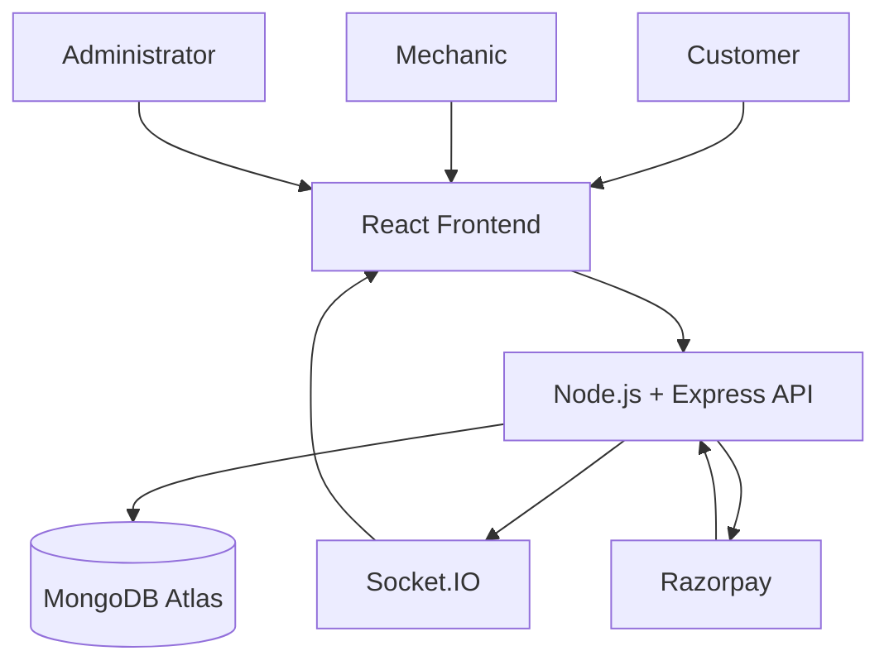

# 🚗 Instant Mechanic

<p align="center">
  
</p>

<p align="center">
  <b>Smart Roadside Assistance & Live Vehicle Service Platform</b>
</p>

<p align="center">
  A full-stack MERN application for booking roadside mechanic services,
  live mechanic tracking, real-time service updates, secure payments,
  reviews, admin operations and financial analytics.
</p>

---

## 🌐 Live Application

### Frontend
https://instant-mechanic-platform.vercel.app

### Backend API
https://instant-mechanic-platform.onrender.com

### GitHub Repository
https://github.com/sanskar8840/instant-mechanic-platform

### Backend Health Check
https://instant-mechanic-platform.onrender.com/api/health

> The backend is hosted on Render Free Tier, so the first request may take a short time if the server is sleeping.

---

# 📌 Project Overview

Instant Mechanic is a real-world roadside assistance platform connecting:

- Customers
- Mechanics
- Administrators

Customers can create service requests for their vehicles, mechanics can manage assigned jobs and share their live location, while administrators can manage platform operations and monitor financial performance.

The application uses a real backend and MongoDB database instead of hardcoded frontend data.

---

# ✨ Main Features

## 👤 Customer Portal

Customers can:

- Create an account and login
- Add and manage vehicles
- Browse available services
- Create roadside assistance bookings
- View booking details
- Track booking status
- Track the assigned mechanic's live GPS location
- Receive real-time booking updates
- Pay for completed services
- Submit reviews and ratings
- View previous bookings

---

## 🔧 Mechanic Portal

Mechanics can:

- Register and login
- View assigned service requests
- Open individual booking details
- Accept assigned bookings
- Update service progress
- Share live GPS location with customers
- Complete service requests
- View customer and vehicle information
- Receive ratings from completed services

### Booking Status Flow

```text
Assigned
   ↓
Accepted
   ↓
On The Way
   ↓
Arrived
   ↓
In Progress
   ↓
Completed
```

The platform prevents invalid status transitions.

---

## 🛡️ Admin Portal

The administrator can:

- View all platform bookings
- View pending bookings
- View active / assigned bookings
- View completed bookings
- View unassigned bookings
- View assigned service requests
- View available mechanics
- Assign mechanics to bookings
- Reassign mechanics when required
- Monitor customer information
- Open the Financial Analytics Center

---

# 📊 Financial Analytics

The Admin Finance Center provides financial monitoring for the platform.

### Service Payment Overview

The system separately tracks:

- Completed Services
- Paid Services
- Awaiting Customer Payments
- Outstanding Payment Amount

This is important because completing a service and receiving payment are two different events.

Example:

```text
Completed Services     4
Paid Services          1
Awaiting Payment       3
```

Only successful customer payments are counted as platform revenue.

---

## 💰 Revenue Analytics

The finance dashboard displays:

- Customer Revenue
- Mechanic Earnings
- Platform Gross Profit
- Platform Net Profit
- Gateway Fees
- Amount Paid to Mechanics
- Pending Mechanic Payouts
- Outstanding Customer Payments
- Number of Paid Services

---

## 📈 Financial Charts

The application uses Recharts to visualize monthly:

- Revenue
- Net Profit
- Paid Services

The administrator can also select a financial year to inspect annual performance.

---

# 👨‍🔧 Mechanic Financial Profiles

The Finance Center contains searchable mechanic financial profiles.

For each mechanic, the admin can view:

- Paid services
- Customer revenue generated
- Total mechanic earnings
- Amount already settled
- Pending payout
- Payment transaction history

Mechanics with pending payouts are prioritized in the interface.

The admin can record a mechanic payout as settled.

> The current payout feature records settlement status inside the platform. It does not initiate an actual bank transfer.

---

# 📍 Live GPS Tracking

Mechanics can share their browser/device location while servicing a booking.

The customer can see the mechanic's updated location using an OpenStreetMap-based map.

Technologies used:

- Browser Geolocation API
- Socket.IO
- Leaflet
- React Leaflet
- OpenStreetMap

Location updates are sent in real time without requiring a full page refresh.

---

# ⚡ Real-Time Updates

Socket.IO is used for real-time communication.

Examples:

```text
Mechanic updates booking status
            ↓
Backend validates status
            ↓
Database is updated
            ↓
Socket.IO event emitted
            ↓
Customer receives updated status
```

Socket connections are authenticated using JWT.

Users can only join booking rooms they are authorized to access.

---

# 💳 Payment Integration

Razorpay is integrated in test mode.

Payment flow:

```text
Service Completed
       ↓
Customer Starts Payment
       ↓
Backend Creates Razorpay Order
       ↓
Customer Completes Payment
       ↓
Backend Verifies Signature
       ↓
Booking Marked as Paid
       ↓
Financial Records Calculated
```

The backend verifies the Razorpay payment signature before updating the booking.

Financial information such as mechanic earnings and platform profit is stored after successful payment verification.

---

# ⭐ Reviews & Ratings

After a successfully completed service, customers can submit a review for the mechanic.

The platform supports:

- Ratings
- Customer feedback
- Mechanic rating statistics
- Review validation

---

# 🏗️ System Architecture



---

# 🛠️ Technology Stack

## Frontend

- React 18
- Vite
- Tailwind CSS
- React Router
- Axios
- Socket.IO Client
- Leaflet
- React Leaflet
- Recharts
- Lucide React

## Backend

- Node.js
- Express.js
- MongoDB
- Mongoose
- JWT Authentication
- bcrypt
- Socket.IO
- Razorpay
- Helmet
- Morgan
- Express Rate Limit

## Database

- MongoDB Atlas

## Deployment

- Frontend: Vercel
- Backend: Render
- Database: MongoDB Atlas
- Source Code: GitHub

---

# 🔐 Authentication & Authorization

The platform uses JWT-based authentication.

Three application roles are supported:

```text
Customer
Mechanic
Admin
```

Protected backend routes check authentication and role permissions.

Socket.IO connections are also authenticated using JWT before allowing access to booking rooms.

---

# 🛡️ Security Features

Implemented security measures include:

- JWT authentication
- Password hashing using bcrypt
- Role-based authorization
- Protected API routes
- Socket authentication
- Booking room authorization
- Razorpay payment signature verification
- Helmet security headers
- API rate limiting
- Environment variables for secrets
- CORS configuration
- Input validation

Sensitive credentials are never committed to GitHub.

---

# 📂 Project Structure

```text
instant-mechanic-platform/
│
├── client/
│   ├── public/
│   │   └── logo.svg
│   │
│   ├── src/
│   │   ├── components/
│   │   ├── context/
│   │   ├── pages/
│   │   ├── services/
│   │   └── App.jsx
│   │
│   └── package.json
│
├── server/
│   ├── config/
│   ├── controllers/
│   ├── middleware/
│   ├── models/
│   ├── routes/
│   ├── server.js
│   └── package.json
│
├── screenshots/
│
├── .gitignore
└── README.md
```

---

# 🔌 API Overview

The backend follows a REST API architecture.

## Health

```http
GET /api/health
```

Checks whether the backend server is running.

---

## Authentication

Authentication APIs handle:

- Registration
- Login
- JWT generation
- Protected user access

---

## Vehicles

Vehicle APIs allow customers to:

- Add vehicles
- View their vehicles
- Manage vehicle information

---

## Services

Service APIs provide available roadside assistance services.

---

## Bookings

Booking APIs support:

- Creating bookings
- Viewing customer bookings
- Viewing booking details
- Updating booking workflow
- Cancelling eligible bookings

---

## Admin APIs

### Get all bookings

```http
GET /api/admin/bookings
```

### Get mechanics

```http
GET /api/admin/mechanics
```

### Assign mechanic

```http
PATCH /api/admin/bookings/:bookingId/assign
```

---

## Admin Finance APIs

### Financial summary

```http
GET /api/admin/finance/summary?year=2026
```

Returns:

- Completed services
- Paid services
- Awaiting payments
- Revenue
- Mechanic earnings
- Platform profit
- Monthly analytics
- Mechanic financial data
- Recent transactions

### Record mechanic payout

```http
PATCH /api/admin/finance/bookings/:bookingId/payout-paid
```

Records the mechanic payout as settled.

---

# ⚙️ Environment Configuration

Never commit the real `.env` files.

Use:

```text
server/.env.example
```

as the reference.

Important backend variables include:

```env
MONGODB_URI=
JWT_SECRET=

RAZORPAY_KEY_ID=
RAZORPAY_KEY_SECRET=

CLIENT_URL=

MECHANIC_SHARE_PERCENT=80
PAYMENT_GATEWAY_FEE_PERCENT=0
```

Frontend environment:

```env
VITE_API_URL=
VITE_SOCKET_URL=
```

Production frontend configuration:

```env
VITE_API_URL=https://instant-mechanic-platform.onrender.com/api
VITE_SOCKET_URL=https://instant-mechanic-platform.onrender.com
```

---

# 💻 Run Locally

## 1. Clone Repository

```bash
git clone https://github.com/sanskar8840/instant-mechanic-platform.git
```

```bash
cd instant-mechanic-platform
```

---

## 2. Backend Setup

```bash
cd server
```

```bash
npm install
```

Create your local `.env` using `.env.example`.

Then run:

```bash
npm run dev
```

If using the production script:

```bash
npm start
```

---

## 3. Frontend Setup

Open another terminal:

```bash
cd client
```

```bash
npm install
```

```bash
npm run dev
```

Frontend will normally run on:

```text
http://localhost:5173
```

---

# 🚀 Deployment

## Frontend

The React/Vite frontend is deployed on Vercel.

Production URL:

https://instant-mechanic-platform.vercel.app

Vercel automatically redeploys when changes are pushed to the `main` branch.

---

## Backend

The Node.js/Express backend is deployed on Render.

Production URL:

https://instant-mechanic-platform.onrender.com

Render automatically redeploys from GitHub after backend changes are pushed.

---

## Database

MongoDB Atlas is used as the production database.

No application data is hardcoded into the frontend.

---

# 🤖 AI Usage

AI was used as an engineering assistant during development.

### Tool Used

- ChatGPT

### AI was used for

- Architecture planning
- Feature planning
- Debugging assistance
- Backend and frontend code suggestions
- Socket.IO implementation guidance
- Payment workflow guidance
- Financial analytics design
- UI/UX iteration
- Security review
- Deployment troubleshooting
- Documentation assistance

### My Contribution

I did not treat generated output as a final solution without testing.

I personally:

- Integrated the frontend and backend
- Configured MongoDB
- Configured environment variables
- Tested customer, mechanic and admin flows
- Debugged authentication and Socket.IO issues
- Tested booking status transitions
- Integrated and tested Razorpay test payments
- Verified live GPS updates
- Added and tested financial analytics
- Tested mechanic payout settlement tracking
- Fixed deployment and CORS issues
- Deployed the frontend and backend
- Tested the production application
- Iteratively modified the UI and functionality based on actual results

---

# 🧠 Engineering Decisions

### Why Socket.IO?

The application requires immediate updates for booking status and mechanic location.

WebSockets avoid repeatedly refreshing the entire page.

### Why MongoDB?

The platform contains related but flexible entities such as:

- Users
- Vehicles
- Services
- Bookings
- Reviews

Mongoose provides schema validation while retaining MongoDB flexibility.

### Why separate Completed and Paid services?

A completed job does not automatically mean the platform has received money.

Therefore:

```text
Completed Service != Paid Service
```

The finance dashboard separately tracks unpaid completed jobs to avoid counting unrealized revenue.

---

# 🏆 What I Am Most Proud Of

The strongest part of this project is that it is not just a static dashboard.

It supports an end-to-end workflow:

```text
Customer Books Service
        ↓
Admin Assigns Mechanic
        ↓
Mechanic Accepts Job
        ↓
Live GPS Tracking Starts
        ↓
Real-Time Status Updates
        ↓
Mechanic Completes Service
        ↓
Customer Makes Payment
        ↓
Financial Analytics Update
        ↓
Mechanic Settlement Tracking
        ↓
Customer Review
```

This connects authentication, database operations, real-time communication, maps, payments and analytics into one complete application.

---

# ⚠️ Current Limitations

This is a portfolio / internship assignment project.

Current limitations include:

- Razorpay currently runs in test mode
- Mechanic payout settlement is recorded in the database but does not initiate a bank transfer
- Payment gateway fee is configurable and currently depends on environment configuration
- Render Free Tier may sleep after inactivity
- Production-scale monitoring and automated payout infrastructure are not yet implemented

---

# 🔮 Future Improvements

Possible future improvements:

- Mechanic verification and admin approval
- Automated bank payouts
- Razorpay webhooks
- Push notifications
- SMS / WhatsApp notifications
- Customer–mechanic chat
- Advanced booking filters
- Pagination for large datasets
- More operational analytics charts
- Service-category analytics
- Customer analytics
- Automated invoice generation
- Refund workflow
- Redis caching
- Docker deployment
- CI/CD testing pipeline
- Cloud monitoring and logging

---

# 👨‍💻 Author

**Sanskar Yadav**

Full Stack / MERN Developer

GitHub:

https://github.com/sanskar8840

---

<p align="center">
  <b>Instant Mechanic</b>
  <br />
  Fast Assistance • Live Tracking • Secure Service
</p>